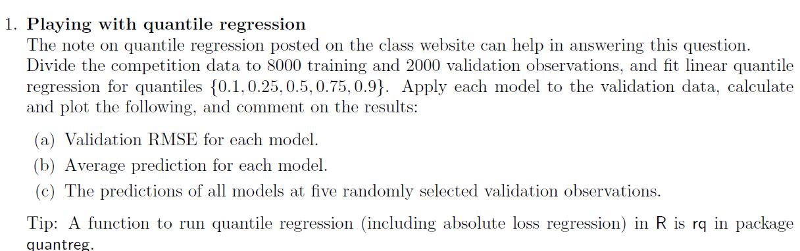
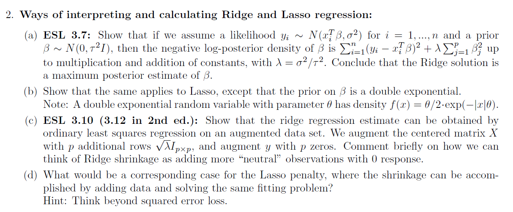
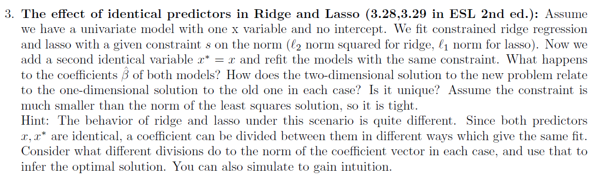
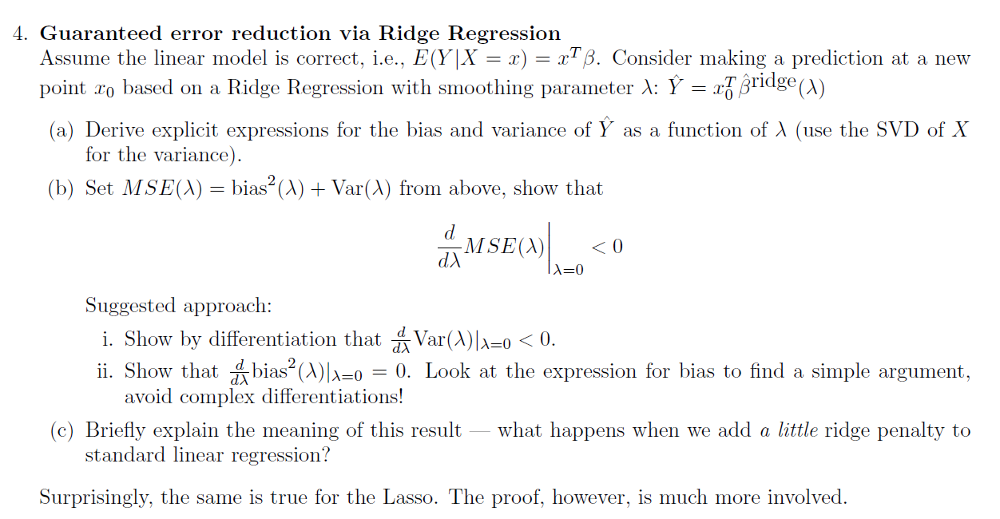
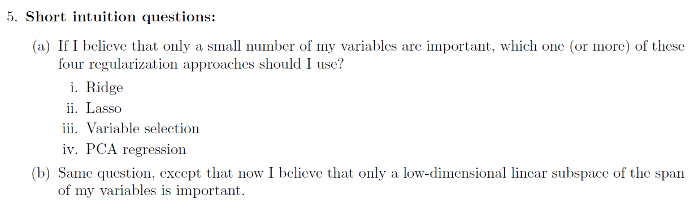

```{r setup, include=FALSE}
knitr::opts_chunk$set(echo = TRUE)
```


```{r message=FALSE, warning=FALSE}
library(dplyr)
library(ggplot2)
library(purrr)
library(quantreg)
library(tidymodels)
```


# Q1




```{r}
con <- url("http://www.tau.ac.il/~saharon/StatsLearn2022/train_ratings_all.dat")
X <- tibble(read.table(con))
con <- url("http://www.tau.ac.il/~saharon/StatsLearn2022/train_y_rating.dat")
y <- read.table(con)

X_full <- X %>% mutate(y = y$V1)
splits <- X_full %>%
  initial_split(prop = 0.8)

X_tr <- training(splits)
X_val <- testing(splits)
set.seed(123)
random_obs <- sample(1:2000,5)
fit_qr <- function(q,X_tr,X_val,random_obs){
  rq_lm <- rq(y~.,tau = q, data = X_tr)
  y_pred <- predict(rq_lm,X_val)
  y_true <- X_val %>% pull(y)
  rmse_res <- rmse_vec(y_pred,y_true)
  avg_pred <- mean(y_pred)
  random_point_pred <- y_pred[random_obs]
  return( list(rmse_res,avg_pred,random_point_pred))
}
qs <- c(0.1,0.25,0.5,0.75,0.9)
rmses <- c()
avg_preds <- c()
random_point_preds <- c()
for (i in 1:5){
  cur_res <- fit_qr(qs[i],X_tr,X_val,random_obs)
  rmses <- c(rmses,cur_res[[1]])
  avg_preds <- c(avg_preds,cur_res[[2]])
  random_point_preds <- c(random_point_preds,cur_res[[3]])
}

red_df <- tibble(q = qs,rmse_res = rmses, avg_pred = avg_preds,
       obs1 = random_point_preds[seq(1,25,5)],
       obs2 = random_point_preds[seq(2,25,5)],
       obs3 = random_point_preds[seq(3,25,5)],
       obs4 = random_point_preds[seq(4,25,5)],
       obs5 = random_point_preds[seq(5,25,5)])

colors = c("rmse_res"="blue", "avg_pred" ="black","obs1"="green","obs2"="purple","obs3"= "red","obs4"= "yellow","obs5"= "orange")
ggplot(data = red_df) + 
  geom_smooth(aes(x = q, y = rmse_res,color = "rmse_res")) +
  geom_smooth(aes(x = q, y = avg_pred,color = "avg_pred")) +
  geom_smooth(aes(x = q, y = obs1,color = "obs1"),linetype='dotted') +
  geom_smooth(aes(x = q, y = obs2,color = "obs2"),linetype='dotted') +
  geom_smooth(aes(x = q, y = obs3,color = "obs3"),linetype='dotted') +
  geom_smooth(aes(x = q, y = obs4,color = "obs4"),linetype='dotted') +
  geom_smooth(aes(x = q, y = obs5,color = "obs5"),linetype='dotted') +
  labs(x="q", y = "", color = "legend")+
  scale_color_manual(values = colors)
```

we can clearly see that as q increases the observation prediction increases and the average prediction increases - meaning are results lean towards higher values

we can also see that the farther away q is from 0.5 the rmse increases as well

# Q2



# Q3




# Q4




# Q5


