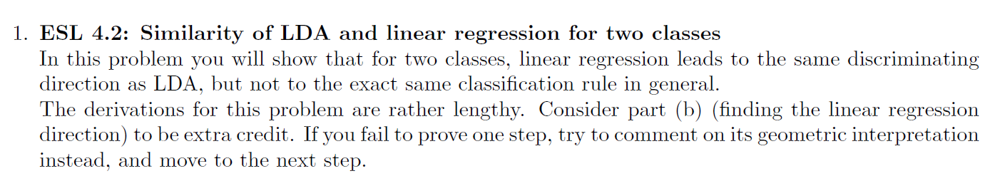
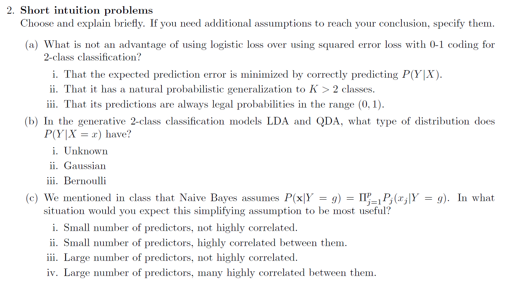
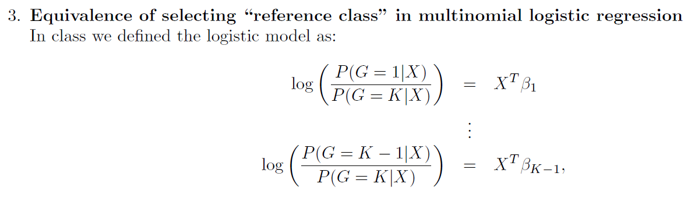
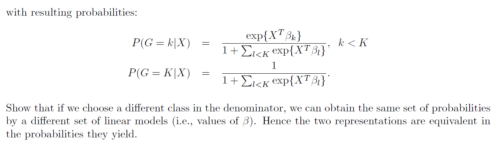
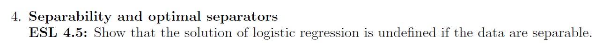
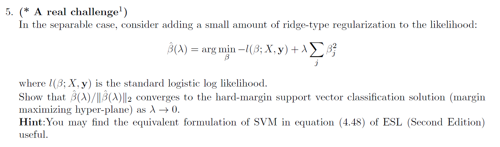

# Q1

# Q2

### a

$$
\text{the answer is i, by predicting correctly P(Y|X) we also minimize the EPE in the linear regression case.}
$$

### b

$$
\text{the answer is iii - Bernoulli}
\\
\text{in the 2 class classification {1,-1}: } P(Y=1|X=x) = 1-P(Y=-1|X=x) = p < 1 \Rightarrow \text{the sidtribution is Bernoulli}
$$

### c

$$
\text{the answer is i - Small number of predictors, not highly correlated.}
\\
\text{if the observations x are  highly correlated then } P(x|Y = g) \ne \Pi^p_{j=1} Pj (xj |Y = g).
\\
\text{if the number of predictors is high this expression will go quicly to zero thus the probabilty will be very low for all x.}
$$

# Q3

$$
\text{wlog lets show that we can switch the denominator to calss 1}
\\
\text{difine } x^t\tilde \beta_i = ln(\frac{P(G=i|x)}{P(G=1|x)}) \quad \forall \ k>i >2
\\
ln(P(G=1|x)) - ln(P(G=K|x)) = x^t\beta_1
\\
ln(P(G=K|x)) - ln(P(G=1|x))  = x^t\tilde\beta_K
\\
\text{summing the 2 aboice equation yields: } x^t\beta_1 = - x^t\tilde\beta_K
\\
x^t\tilde \beta_i = ln(\frac{P(G=i|x)}{P(G=1|x)}) = ln(P(G=i|x)) - ln(P(G=1|x)) + ln(P(G=K|x)) - ln(P(G=K|x)) = ln(\frac{P(G=i|x)}{P(G=K|x)}) + -x^t\beta_1 = x^t(\beta_i - \beta_1)
\\
\text{thus we get that } \tilde \beta_i = \beta_i - \beta_1 \ \&\ \tilde\beta_K = - \beta_1
\\
\text{this is the new linear model, we are left with shoing that the probabilities are the same}
\\
P(G=k|x) [under class K as refrence] = \frac{e^{x^t\beta_k}}{1 + \sum_{l<K}e^{x^t\beta_l}} = \frac{e^{x^t\beta_k}}{1 + \sum_{l<K}e^{x^t\beta_l}} \frac{e^{-x^t\beta_1}}{e^{-x^t\beta_1}} = 
\frac{e^{x^t\tilde \beta_k}}{e^{-x^t\beta_1} + \sum_{l<K}e^{x^t\tilde \beta_l}} =_* \frac{e^{x^t\tilde \beta_k}}{1 + \sum_{1<l}e^{x^t\tilde \beta_l}} = P(G=k|x) [under class 1 as refrence]
\\
*: e^{-x^t\beta_1} + \sum_{l<K}e^{x^t\tilde \beta_l} = e^{-x^t\beta_1} + \sum_{1 <l<K}e^{x^t\tilde \beta_l} + e^{x^t\tilde \beta_1} = 
e^{x^t\tilde \beta_K} + \sum_{1 <l<K}e^{x^t\tilde \beta_l} + e^{x^t 0}  = 1 + \sum_{1<l}e^{x^t\tilde \beta_l}
$$

# Q4

# Q5

